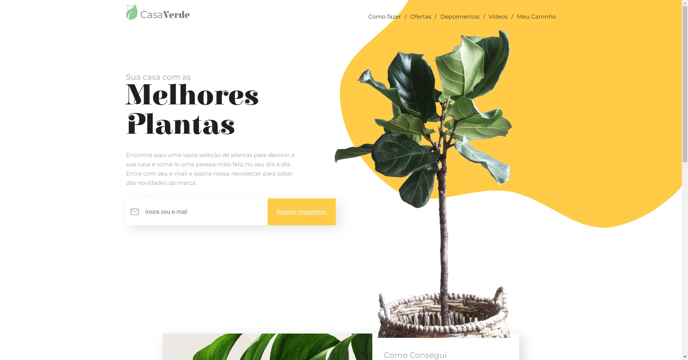
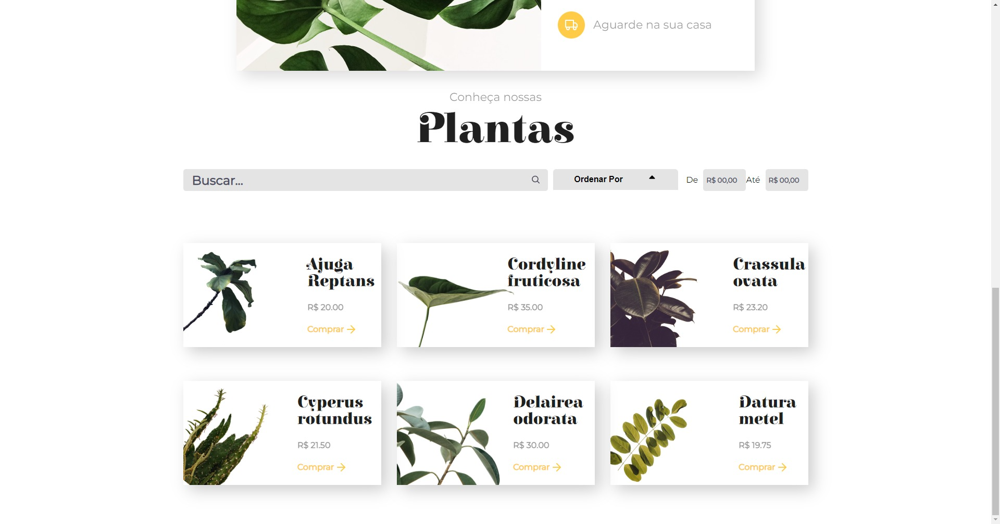
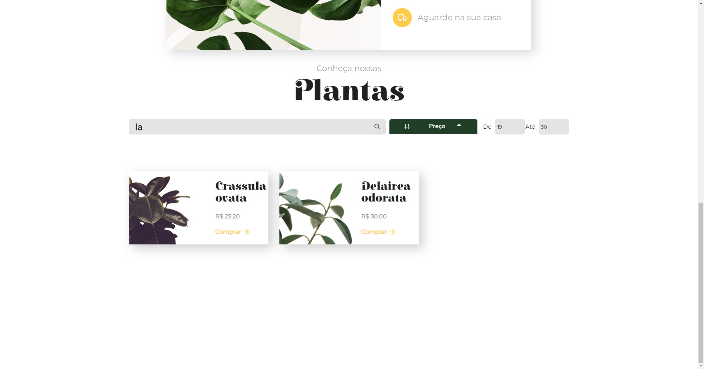

<h1 align="center">CasaVerde</h1>

  

<!--  -->
</img>
</img> 
</img>
</img> 

 

## 💻 Projeto

O <b>CasaVerde</b> e o web site de uma floricultura, foi desenvolvido para o desafio [7 Days of Code](https://7daysofcode.io/matricula/react)
## ✨ Tecnologias

Esse projeto foi desenvolvido com as seguintes tecnologias:

- [NodeJS](https://nodejs.orgen/)
- [TypeScript](https://www.typescriptlang.org/)
- [React](https://reactjs.org/)
- [Styled Components](https://styled-components.com/)
- [HTML](https://developer.mozilla.org/pt-BR/docs/Web/HTML)

## 🚀 Como executar

- Clone o repositório
- Rode `cd 7days` para ir até a pasta do projeto
- Rode `npm install` para instalar as dependências
- Rode o `npm run dev` para iniciar a aplicação na porta <b>3000</b>
- Por fim, o <b>Website</b> estará disponível em `http://localhost:3000`

## 📄 Licença

Esse projeto está sob a licença MIT. Veja o arquivo [LICENSE](LICENSE) para mais detalhes.